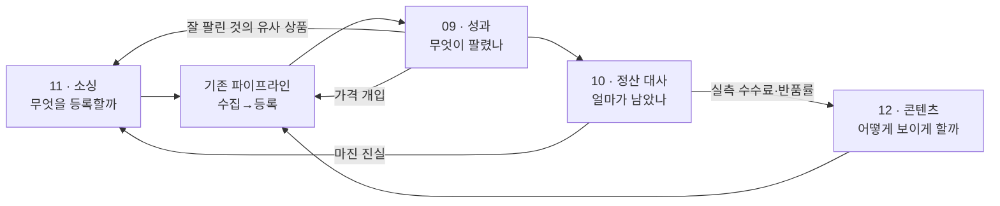

# Tetragon v2 확장 기능 — 개요와 공통 기반

> 작성 2026-08-23 · 전제: [02-아키텍처-v2.md](02-아키텍처-v2.md) rev.2
> **이번 판부터는 실제 소스 코드를 읽고 씁니다.** rev.2 README의 "이 세션에는 실제 소스 코드가 없어
> 파일 경로·클래스명은 `ARCHITECTURE.md` 기재를 따랐습니다"라는 한계가 해소됐습니다.
> 아래 모든 시그니처·파일 경로·줄 수는 `C:\Users\A\...\Tetragon` 워킹 디렉터리의 실제 코드에서 확인한 값입니다.

---

## 0. 이 문서 묶음이 하는 일

v2(01~07)는 **지금 있는 것을 안 터지게 만드는 설계**였습니다. 영속 큐, 발주 사가, 채널 리미터, 검증 게이트 — 전부 내구성입니다.

08~12는 **그 위에 새로 얹는 기능**입니다. 네 가지입니다.

| 문서 | 기능 | 한 줄 |
|---|---|---|
| [09](09-성과루프-리프라이싱.md) | 성과 루프 & 자동 리프라이싱 | 무엇이 팔리는지 시스템이 알게 하고, 가격을 스스로 고치게 한다 |
| [10](10-정산대사-수익회계.md) | 정산 대사 & 수익 회계 | **지금 화면에 뜨는 마진은 틀렸다.** 정산 내역으로 진실을 만든다 |
| [11](11-소싱-인텔리전스.md) | 소싱 인텔리전스 | "무엇을 등록할지" 고르는 단계를 신설한다 |
| [12](12-AI-콘텐츠-스튜디오.md) | AI 콘텐츠 스튜디오 | 번역기를 콘텐츠 생산 설비로 바꾼다 (+ 2026 쿠팡 필수필드 확보) |

### 왜 이 네 개인가 — 하나의 루프다

v2 README는 목표 함수를 이렇게 바꿨습니다.

```
v1 목표:  maximize( 등록 성공 건수 )
v2 목표:  maximize( 등록 슬롯당 기대이익 )
```

그런데 **기대이익을 계산할 재료가 시스템에 하나도 없습니다.** 코드를 확인했습니다.

- `Listing`([Listing.cs](../../src/Tetragon.Domain/Listing/Listing.cs), 63줄)에는 `Status`, `MarketItemId`, `ListedPrice`, `SyncLogs`뿐입니다. **노출·클릭·주문 필드가 없습니다.**
- `Order.EstimatedMargin`([Order.cs](../../src/Tetragon.Domain/Ordering/Order.cs))은 `PaidAmount − SupplierPaidAmount`입니다. **마켓 수수료도 부가세도 반품비도 빠져 있습니다.**
- `AiResult.InputTokens/OutputTokens`([Ai.cs](../../src/Tetragon.Plugin.Abstractions/Ai.cs))는 채워지지만 **어디에도 저장되지 않고 버려집니다.**

즉 지금 시스템은 자기가 돈을 벌었는지 잃었는지 모릅니다. 네 기능은 그 고리를 순서대로 잇습니다.



**F1(성과)과 F2(정산)이 먼저입니다.** F3·F4는 F1·F2가 만든 실측을 먹고 삽니다. v2 §4.2가 "실측 없는 상수로 카탈로그의 운명을 결정하지 말라"고 경고한 그 실측이 여기서 생깁니다.

---

## 1. 공통 기반 ① — AttentionLedger

### 1.1 왜 필요한가

v2 §0 원칙 5는 이렇게 바뀌었습니다.

> **유한 자원은 등록 슬롯이 아니라 운영자의 주의(attention)다.**

그런데 v2 설계 어디에도 **주의를 담는 자료구조가 없습니다.** 대신 사람이 봐야 하는 것이 문서 곳곳에 흩어져 있습니다.

| 출처 | 사람이 봐야 하는 것 |
|---|---|
| v2 §2.1 | `work_items.state = 'dead'` |
| v2 §2.4 | 사가 `Disputed`, `NeedsHuman`, 과지불 홀드 |
| v2 §2.5 | 쿼터 소진 |
| v2 §4.3 | `operate.prune` 제안 목록 |
| v2 §7.2 | 자동화 정지, 환율 폴백 지속 |
| v2 §7.4 | 가격 계산 중단 |
| 현재 코드 | `Product.Blocked`, `ScrapeJob.DeadLettered`, `CsTicket.SupplierActionRequired`, `Wallet.IsLow` |
| 신규 09~12 | 역마진 상품, 위너 상실, 정산 미매칭, 소싱 후보 승인, 콘텐츠 검증 실패 |

이대로 두면 신규 기능 네 개가 각자 알림을 보내고, 1인 운영자는 **알림 피로로 전부 무시하게 됩니다.** 알림을 늘리는 기능을 네 개나 추가하기 전에, 주의를 한 곳에 모으고 **줄을 세우는 장치**부터 만듭니다.

### 1.2 스키마

```sql
CREATE TABLE attention_items (
  id               TEXT PRIMARY KEY,          -- GUID
  tenant_id        TEXT NOT NULL DEFAULT 'default',
  kind             TEXT NOT NULL,             -- §1.4 표
  subject_type     TEXT NOT NULL,             -- 'product'|'listing'|'order'|'candidate'|'settlement_line'|'work_item'|'system'
  subject_id       TEXT NOT NULL,
  severity         TEXT NOT NULL,             -- 'info'|'warn'|'critical'
  impact_krw       REAL NOT NULL,             -- ★ 이걸 처리하면 얼마가 걸려 있나 (월 환산, 원)
  impact_basis     TEXT NOT NULL,             -- ★ 그 숫자의 근거 문장 (사람이 읽는다)
  title            TEXT NOT NULL,
  detail_json      TEXT NOT NULL DEFAULT '{}',
  suggested_action TEXT,                      -- 'reprice'|'prune'|'purchase'|'recontent'|'verify'|'settle'|'none'
  state            TEXT NOT NULL DEFAULT 'open',   -- open|snoozed|done|dismissed
  snooze_until     INTEGER,
  dedup_key        TEXT NOT NULL,
  first_seen_at    INTEGER NOT NULL,
  last_seen_at     INTEGER NOT NULL,
  seen_count       INTEGER NOT NULL DEFAULT 1,
  resolved_at      INTEGER,
  resolved_by      TEXT,                      -- 'human'|'auto'
  resolution_note  TEXT
);

CREATE UNIQUE INDEX ux_attention_dedup ON attention_items(tenant_id, kind, dedup_key)
  WHERE state IN ('open','snoozed');
CREATE INDEX ix_attention_queue ON attention_items(state, impact_krw DESC);
CREATE INDEX ix_attention_subject ON attention_items(subject_type, subject_id);
```

### 1.3 규약 — 이 세 줄이 설계의 전부입니다

**① `impact_krw` 없이는 attention_item을 만들 수 없습니다.**
추정이어도 좋지만 `impact_basis`에 계산식을 적어야 합니다. 예: `"최근 30일 주문 4건 × 개당 손실 1,240원 → 월 4,960원"`.
근거를 못 적는 항목은 애초에 사람 시간을 쓸 가치가 없다는 뜻입니다. 이 규칙 하나가 알림 폭주를 막습니다.

**② 하루에 새로 열리는 항목은 상한이 있습니다** (기본 30건, `AttentionPolicy.DailyOpenCap`).
상한을 넘으면 `impact_krw` 상위 30건만 열고, 나머지는 **집계 항목 1건**으로 접습니다 —
`"역마진 상품 218건 (합계 월 −84만원) — 일괄 처리 필요"`.
개별 항목을 조용히 버리지 않고, 묶어서 한 줄로 보여줍니다.

**③ `dedup_key`는 "같은 사실"의 정의입니다.**
같은 리스팅의 역마진이 매일 재검출돼도 항목은 하나이고 `seen_count`와 `last_seen_at`만 오릅니다.
사실이 사라지면 스윕퍼가 `state='done', resolved_by='auto'`로 닫습니다 —
**사람이 손대지 않아도 저절로 닫히는 항목이 있어야 목록이 신뢰를 얻습니다.**

### 1.4 kind 목록 (신규 기능이 채움)

| kind | 출처 | impact_krw 산정 |
|---|---|---|
| `margin.loss` | 09 리프라이싱 평가 | 최근 30일 판매수량 × 개당 손실 |
| `margin.thin` | 09 | 위와 같음, 기준 마진 미달분 |
| `winner.lost` | 09 위너 감시 | 상실 직전 30일 매출 × 추정 이익률 |
| `perf.dead` | 09 롤업 | 0 (정보) — 정리 후보, 등록한도 회수량으로 대체 표기 |
| `settle.unmatched` | 10 대사 | \|정산 라인 net\| |
| `settle.gap` | 10 | \|확정이익 − 추정이익\| (상품 단위) |
| `saga.disputed` | v2 §2.4 | 예약 금액 |
| `work.dead` | v2 §2.1 | 0 (정보) — 단, `pipeline.publish` 실패는 해당 상품 추정 월이익 |
| `source.candidate` | 11 소싱 | 후보 추정 월이익 합계 (승인 대기 묶음) |
| `content.rejected` | 12 콘텐츠 | 0 (정보) |
| `regulation.blocked` | 12 속성 추출 | 등록 못 한 상품 수 × 카테고리 평균 월이익 |

### 1.5 코드 배치

```
src/Tetragon.Domain/Attention/AttentionItem.cs          신규 — 애그리거트
src/Tetragon.Application/Ports.cs                        IAttentionRepository 추가
src/Tetragon.Application/Services/AttentionLedger.cs      신규 — Open/Touch/Resolve/Fold
src/Tetragon.Infrastructure/Persistence/Repositories.cs   AttentionRepository 추가
src/Tetragon.Infrastructure/Persistence/TetragonDbContext.cs  DbSet + 인덱스
src/Tetragon.Api/Endpoints/AttentionEndpoints.cs         신규
frontend/src/features/attention/Attention.tsx            신규 — /attention
```

```csharp
// src/Tetragon.Application/Services/AttentionLedger.cs
public sealed class AttentionLedger(IAttentionRepository repo, ILogger<AttentionLedger> log)
{
    /// <summary>사실을 기록한다. 이미 열려 있으면 last_seen_at·seen_count만 올린다.</summary>
    public Task<AttentionItem> OpenAsync(AttentionDraft draft, CancellationToken ct);

    /// <summary>사실이 사라졌다 — 사람이 손대지 않아도 닫는다.</summary>
    public Task ResolveAutoAsync(string kind, string dedupKey, string note, CancellationToken ct);

    /// <summary>DailyOpenCap 초과분을 집계 항목 1건으로 접는다.</summary>
    public Task<int> FoldOverflowAsync(string kind, CancellationToken ct);
}

public sealed record AttentionDraft
{
    public required string Kind { get; init; }
    public required string SubjectType { get; init; }
    public required string SubjectId { get; init; }
    public required string DedupKey { get; init; }
    public required string Title { get; init; }
    public required decimal ImpactKrw { get; init; }   // ★ 필수. 0이어도 명시해야 한다
    public required string ImpactBasis { get; init; }  // ★ 필수
    public AttentionSeverity Severity { get; init; } = AttentionSeverity.Warn;
    public string? SuggestedAction { get; init; }
    public Dictionary<string, object?> Detail { get; init; } = [];
}
```

`ImpactKrw`/`ImpactBasis`를 `required`로 둔 것이 핵심입니다 — **컴파일러가 규약을 강제합니다.**

### 1.6 API · 화면

```
GET  /api/v1/attention?state=open&kind=&limit=50     impact_krw DESC 정렬
POST /api/v1/attention/{id}/snooze   { untilDays }
POST /api/v1/attention/{id}/done     { note }
POST /api/v1/attention/{id}/dismiss  { note }
POST /api/v1/attention/bulk          { ids[], action }   일괄 처리
GET  /api/v1/attention/summary       kind별 건수·합계 impact
```

화면 `/attention` — **사이드바 최상단, 대시보드보다 위**에 둡니다.
`App.tsx`의 `NAV` 배열 첫 항목에 `{ to: '/attention', label: '할 일' }`을 넣고, 열린 항목 수를 배지로 표시합니다.
v2 README가 "여기가 진짜 목적지"라 부른 **"이번 주에 손댈 상품 10개" 화면이 바로 이것**입니다.

---

## 2. 공통 기반 ② — work_items kind 확장

v2 §2.1의 `work_items` 위에 신규 kind를 얹습니다. **새 워커를 만들지 않습니다** — v2가 "워커 8종은 구조가 아니라 설정"이라고 정리한 그대로, 루프 1개에 kind 필터만 추가합니다.

| kind | 문서 | 스케줄 | 동시성 | 부작용 | `external_calls` |
|---|---|---|---|---|---|
| `perf.import` | 09 | 사용자 업로드 | 1 | 없음(DB만) | — |
| `perf.rollup` | 09 | 일 1회 03:00 KST | 1 | 없음 | — |
| `perf.tier` | 09 | 일 1회 03:30 KST | 1 | 없음 | — |
| `winner.check` | 09 | 티어 A 일 1회 | 2 | 읽기 호출 | — |
| `reprice.evaluate` | 09 | 일 1회 + 원가변동 | 1 | 없음 | — |
| `reprice.apply` | 09 | 평가 결과마다 | 2 | **마켓 쓰기** | `market.reprice.{ch}` |
| `settle.import` | 10 | 사용자 업로드 | 1 | 없음 | — |
| `settle.match` | 10 | 임포트 직후 | 1 | 없음 | — |
| `settle.close` | 10 | 월 1회 | 1 | 없음 | — |
| `source.harvest` | 11 | 사용자 실행 | 2 | 공급처 읽기 | — |
| `source.score` | 11 | harvest 뒤 | 4 | AI 선택적 | `ai.*` |
| `content.compose` | 12 | 사용자/자동 | 2 | **AI 호출(과금)** | `ai.{capability}` |
| `content.verify` | 12 | compose 뒤 | 4 | 없음 | — |
| `content.publish` | 12 | 승인 뒤 | 2 | **마켓 쓰기** | `market.update.{ch}` |
| `attention.sweep` | 08 | 시간당 | 1 | 없음 | — |

**부작용이 있는 kind는 예외 없이 `external_calls`를 씁니다** (v2 §2.3). 리스 만료로 재실행돼도 마켓에 두 번 쓰지 않습니다.

### 2.1 팬아웃 상한 재확인

v2 §2.1은 "스케줄러는 틱당 최대 N건(기본 500)만 생성"이라 했습니다. 신규 kind가 이 상한을 공유합니다. 특히:

- `reprice.evaluate`는 리스팅 전량을 도는 것이 아니라 **티어 A + 원가 변동분 + 성과 임포트로 갱신된 것**만 큐에 넣습니다.
- `content.compose`는 **비용이 나가므로 자동 팬아웃을 하지 않습니다.** 사람이 목록을 골라 큐에 넣습니다(일괄 승인).

---

## 3. 공통 기반 ③ — CSV 임포트 프레임 (09·10 공용)

09(성과)와 10(정산)은 둘 다 "마켓 판매자센터에서 CSV를 내려받아 올린다"입니다. 같은 문제를 두 번 풀지 않도록 한 곳에 둡니다.

### 3.1 왜 API가 아니라 CSV인가

v2 §4.3이 이미 답했습니다 — 통계 API 연동은 수 주짜리인데 산출물이 같습니다. 여기에 하나 더:
**정산 데이터는 API로 받아도 사람이 판매자센터에서 눈으로 대조하게 됩니다.** 같은 파일을 쓰면 대조가 쉽습니다.

### 3.2 헤더 지문(fingerprint) — 컬럼명이 바뀌는 문제

마켓은 CSV 컬럼명을 예고 없이 바꿉니다. 매핑을 코드에 박으면 그때마다 배포해야 합니다.

```sql
CREATE TABLE import_profiles (
  id                  TEXT PRIMARY KEY,
  channel             TEXT NOT NULL,        -- 'coupang'|'smartstore'|'11st'
  purpose             TEXT NOT NULL,        -- 'perf'|'settlement'
  header_fingerprint  TEXT NOT NULL,        -- sha256(정규화된 헤더 배열)
  column_map_json     TEXT NOT NULL,        -- {"노출수":"impressions", ...}
  sample_header_json  TEXT NOT NULL,
  created_at          INTEGER NOT NULL,
  created_by          TEXT NOT NULL         -- 'seed'|'human'
);
CREATE UNIQUE INDEX ux_import_profile ON import_profiles(channel, purpose, header_fingerprint);
```

흐름:

```
파일 업로드
  → 헤더 정규화(공백·괄호·단위 제거) → sha256 지문
  → 지문 일치 프로파일 있음 → 그대로 파싱
  → 없음 → 400 + "새 양식입니다" + 헤더 목록 + 추정 매핑 반환
           사람이 화면에서 매핑 확정 → 프로파일 저장 → 재시도
```

**추측으로 파싱하지 않습니다.** 잘못 매핑된 정산 데이터는 틀린 이익을 확신 있게 보여주는데, 그게 데이터가 없는 것보다 나쁩니다.

### 3.3 임포트 트랜잭션 규약

1. **전량 검증 후 적재.** 한 줄이라도 파싱 실패면 파일 전체를 거부합니다(부분 적재 금지).
2. **합계 검증.** 정산은 `Σnet == 파일이 명시한 정산총액`을 확인합니다. 불일치면 거부.
3. **재업로드 = 덮어쓰기.** 자연키 UPSERT(09: `(listing_id, date, source)`, 10: `(channel, settle_date, market_order_id, line_type, seq)`).
4. **원본 보존.** 업로드된 파일 자체를 `imports/{id}.csv`로 남깁니다 — 대사 분쟁 시 유일한 근거입니다.

### 3.4 공용 코드

```
src/Tetragon.Application/Services/Import/CsvImporter.cs        신규 — 지문·매핑·검증
src/Tetragon.Application/Services/Import/ImportProfileStore.cs 신규
src/Tetragon.Api/Endpoints/ImportEndpoints.cs                  신규
```

기존 `uploadExcel<T>()`([frontend/src/shared/api.ts](../../frontend/src/shared/api.ts) 말미)를 그대로 재사용합니다 — multipart 업로드 헬퍼가 이미 있습니다.

---

## 4. 도입 순서

v2 로드맵(Day 0 → Week 6)이 **끝난 뒤**를 전제합니다. 특히 `work_items`(v2 마이그레이션 4번)와 알림 채널(v2 §7.2)이 없으면 아래는 전부 반쪽입니다.

| # | 작업 | 규모 | 선행 | 왜 이 순서인가 |
|---|---|---|---|---|
| 0 | **AttentionLedger** | 1~2일 | v2 W1 | 뒤 네 기능이 전부 여기에 쓴다. 나중에 붙이면 네 번 고쳐야 한다 |
| 1 | **09-a 성과 CSV → `listing_perf` + 티어** | 2~3일 | 0 | v2가 "진짜 목적지"라 부른 것. 이게 없으면 09·11·12가 전부 감(感)이다 |
| 2 | **10-a 정산 CSV → 대사 → `order_pnl(settled)`** | 3~4일 | 0 | 이익의 유일한 진실. 성과 CSV의 '매출'은 취소·반품 전 숫자다 |
| 3 | **10-b `MarginModel` 정정 (VAT·반품률·세금계산서)** | 1~2일 | 2 | **현재 `MarginHealth`는 마진을 약 9%p 과대계상한다** (10 §2). 이후 모든 계산의 기준점 |
| 4 | **09-b 리프라이싱 — `CostChangeRule`만, DryRun** | 2~3일 | 3 | 역마진은 조용한 손실이다. 가장 안전한 규칙 하나로 시작 |
| 5 | **12-a `AttributeExtract` (브랜드·모델번호)** | 2일 | 0 | 2026-08-01 쿠팡 필수필드. 규제 대응이라 급하면 1번보다 앞으로 당겨도 된다 |
| 6 | **12-b `DetailCompose` + 결정적 검증** | 3~4일 | 5 | 상세 콘텐츠가 없는 리스팅은 측정할 것도 없다 |
| 7 | **09-c 위너 감시 (대리지표)** | 2일 | 1 | 09 §5 — 공개 API 부재를 정직하게 우회 |
| 8 | **11 소싱 인텔리전스** | 4~5일 | 1,3 | 앞의 실측이 다 있어야 점수가 거짓말을 안 한다 |
| 9 | **12-c A/B 실험** | 2일 | 1,6 | 표본이 쌓여야 판정이 가능 |

**1번과 2번만 해도** "무엇이 팔렸고 얼마가 남았는가"에 처음으로 답할 수 있습니다. 나머지는 그 답을 근거로 움직이는 장치입니다.

### 만들지 않는 것 (트리거를 적어 둡니다)

| 항목 | 트리거 |
|---|---|
| 마켓 통계·정산 **API** 연동 | CSV 임포트를 주 1회 이상 하게 되고, 그 수작업이 30분을 넘을 때 |
| 광고 자동 입찰 | 광고비 지출이 월 100만원을 넘고, ROAS를 상품 단위로 귀속할 수 있을 때(= 10번 완료 후) |
| 이미지 생성·합성(누끼·배경) | `ImageAudit`(12)이 "이미지 때문에 반려된 상품"을 월 20건 이상 집계할 때 |
| 실시간 위너 폴링 | 쿠팡이 위너 조회 공개 API를 제공할 때. 그전에는 대리지표 |
| 다계정·다마켓 성과 통합 | 마켓 계정이 2개 이상 될 때 (v2 §6과 동일 트리거) |
| 예측 모델(ML) | `listing_perf` 12개월 + `order_pnl(settled)` 1,000건 이상 |

---

## 5. 이 문서 묶음의 한계

- **정산·성과 CSV의 실제 컬럼 구조를 확인하지 못했습니다.** 쿠팡 WING·네이버 커머스솔루션의 다운로드 양식을 직접 열어 보지 않았고, 그래서 §3.2의 지문 방식을 택했습니다 — 양식을 모르는 상태에서 안전한 유일한 설계입니다. 첫 임포트 때 실제 헤더로 프로파일을 시드하십시오.
- **쿠팡 아이템위너 조회 API의 존재 여부를 확인하지 못했습니다.** 09 §5에서 대리지표를 1차 수단으로 설계한 이유입니다.
- **AI 생성 콘텐츠의 마켓 심사 통과율은 미지수입니다.** 12는 카나리(소량 선행 등록, v2 §7.3)를 전제로 합니다.
- **여기 적힌 어떤 것도 코드에 적용해 검증하지 않았습니다.** v2 rev.2와 같은 한계입니다. 특히 리프라이싱(09)과 대사(10)는 돈에 직접 닿으므로 v2 §7.3의 테스트 없이 켜지 마십시오.
