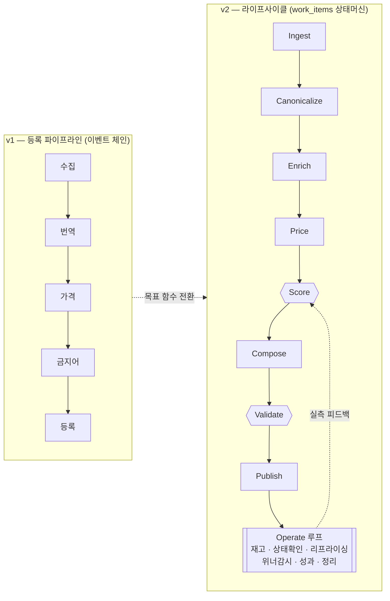

# Tetragon v2 — 진단 · 설계 · 실행 계획 (rev.2 + 확장 08~12)

> 작성 2026-08-22 · 확장 2026-08-23 · 대상: 테트라곤 프로젝트 (자동 등록 / 대량 등록 위탁판매)
> 입력: 기존 `ARCHITECTURE.md` + 2026년 8월 시점 마켓 정책·공급처·경쟁 솔루션·판매 실전 조사
> **rev.2 — 초판을 적대적으로 재검토해 26건의 오류를 고친 판본입니다.** 무엇이 왜 바뀌었는지는 [07-재검토.md](07-재검토.md)
> **08~12 — 실제 소스 코드를 읽고 쓴 신규 기능 설계입니다.** 시작점은 [08-확장기능-개요.md](08-확장기능-개요.md)

---

## 한 장 요약

**결론부터**: 코드 품질이 문제가 아닙니다. 문제는 두 가지입니다.

**첫째, 시스템의 목표 함수가 시장과 어긋나 있습니다.**

Tetragon은 "많이 등록하면 그중 팔린다"를 전제로 설계됐습니다 — 파이프라인이 `수집 → 등록`으로 끝나고 등록 이후를 다루는 코드가 재고 동기화(수동 버튼)와 주문 처리뿐인 것이 그 증거입니다. 그런데 그 전제는 애초에 틀렸고, 2026년 상반기 규제 변경이 그 사실을 더 명백하게 만들었습니다.

```
v1 목표:  maximize( 등록 성공 건수 )
v2 목표:  maximize( 등록 슬롯당 기대이익 )   s.t. 마켓 쿼터, 규제 제약, 운영자의 시간
```

> ⚠️ **초판은 이 결론의 근거를 규제에 뒀는데, 정확하지 않습니다.** 진짜 이유는 규제가 아니라 구조입니다 — 네이버 콜드스타트(신규 상품은 실적 0 → 노출 안 됨 → 실적 안 쌓임)와 "같은 도매 상품을 수백 명이 판다"는 조건은 수년간 참이었습니다. 규제를 근거로 삼으면 "규제가 완화되면 대량등록으로 돌아가도 되나"라는 잘못된 함의가 생깁니다. 자세한 반론은 [01 §0.1](01-진단.md).

**둘째, 인프라가 프로토타입 상태로 굳어 있습니다.** 이벤트 큐가 메모리에 있어 재시작하면 작업이 사라지고, 금고 예약금이 영구히 잠길 수 있으며, 발주 응답이 유실되면 이중 결제 위험이 있고, 재고 동기화가 수동 버튼입니다.

**그리고 셋째 (08~12에서 추가로 확인)**: **시스템이 자기가 돈을 벌었는지 잃었는지 모릅니다.** `Listing`에 노출·클릭·주문 필드가 없고, `Order.EstimatedMargin`에 마켓 수수료가 빠져 있고, `MarginHealth`는 부가세를 다루지 않아 마진을 약 9%p 과대계상합니다. 목표 함수를 "기대이익"으로 바꿔 놓고 이익을 계산할 재료가 없는 상태입니다. → [10 §0](10-정산대사-수익회계.md)

### 2026년 상반기 규제 변경 (1차 출처 직접 확인)

| 변경 | 시행 | 실제 영향 |
|---|---|---|
| 쿠팡 **브랜드/GTIN·모델번호/구매옵션 필수** | 2026-08-01 | **현재 파이프라인에 이 데이터가 없음 → 등록 실패.** 노브랜드 위탁의 진짜 벽 |
| 쿠팡 **단일상품페이지(SDP) 의무화** | 2026-06-20 | 동일 상품 강제 통합. 단 **브랜드·모델·바코드가 있어야 병합**되므로 노브랜드 잡화에는 영향이 제한적 |
| 네이버 **등록한도 판매실적 기반 개편** | 2026-06-02 | 안 팔리는 상품이 한도 잠식. **단 스마트스토어를 실제 운영 중인지 먼저 확인 필요** — 어댑터가 위탁 발주 불가 상태 |
| 쿠팡 일 5,000건 + rps 5 (KST) | 운영 중 | 상품 1만 개면 **이틀이면 전량 등록** — 지금 규모에선 구속 제약 아님 |

*(전거: [05-마켓-규제-2026.md](05-마켓-규제-2026.md) · 대응 구현: [12 §1.1 `AttributeExtract`](12-AI-콘텐츠-스튜디오.md))*

### 발견한 문제 42건

| 등급 | 건수 | 대표 |
|---|---|---|
| **P0** 데이터 유실·금전 사고 | 7 | 인메모리 큐, 금고 예약금 영구 잠김, 발주 중복 위험, 자격증명 평문, 스키마 롤백 불가 |
| **P1** 확장 불가·정확성 | 13 | **재고 동기화가 수동 버튼(★최우선)**, 마켓별 레이트리밋 미분리, 재시도가 수집 단계에만 |
| **P2** 2026 규제 미대응 | 6 | 위 표 |
| **P3** 기능 공백 | 8 | 성과 데이터 없음, 카테고리 매핑 재사용 없음, 엑셀 피드 커넥터 없음 |
| **P4** 국소 버그 | 8 | 한→한 번역 비용 누수, 관세 고정환율, 쿼리 키 충돌 |

### 설계가 잘 된 것 (다시 만들지 말고 감쌀 것)
`Wallet` 예약→확정 2단계 · `ConsignmentLogistics` 출고지/반품지 4단계 판정 · `PriceCalculation.Steps` · `MarginHealth` · SSE 실시간 피드. 뼈대가 좋으니 **내구성만 씌우면 됩니다.**

---

## 문서 구성

### 진단과 내구성 (rev.2)

| 문서 | 내용 |
|---|---|
| [01-진단.md](01-진단.md) | 문제점 42건 + 자기 반론(§0.1) |
| [02-아키텍처-v2.md](02-아키텍처-v2.md) | **rev.2** — 영속 큐, 발주 사가, 채널 리미터, 상태머신 파이프라인, 운영 루프 |
| [03-패치-스펙.md](03-패치-스펙.md) | **rev.2** — Day 0 / Week 1~6 실행 스펙 + 코드 골격 |
| [04-공급처-연동.md](04-공급처-연동.md) | 도매꾹 외 공급처 15곳 + 붙이는 방법 |
| [05-마켓-규제-2026.md](05-마켓-규제-2026.md) | 마켓 API 스펙·제약·2026 규제 체크리스트 |
| [06-판매-플레이북.md](06-판매-플레이북.md) | 안 팔리는 이유 6가지 → 코드로 막을 수 있는 것과 없는 것 |
| [07-재검토.md](07-재검토.md) | **초판에서 틀린 26건과 그 수정 내역** |

### 확장 기능 (2026-08-23, 실제 소스 코드 기반)

| 문서 | 내용 |
|---|---|
| [08-확장기능-개요.md](08-확장기능-개요.md) | **여기서 시작** — 네 기능의 관계, `attention_items` 공통 기반, CSV 임포트 프레임, 도입 순서 |
| [09-성과루프-리프라이싱.md](09-성과루프-리프라이싱.md) | `listing_perf` 원장 · 티어링 · `IRepriceRule` 4종 · 위너 대리지표 · 등록 생존 확인 |
| [10-정산대사-수익회계.md](10-정산대사-수익회계.md) | **`MarginHealth`가 9%p 과대계상한다는 증명** · 정산 대사 3단계 · `order_pnl` 추정/확정 분리 · 계수 역산 |
| [11-소싱-인텔리전스.md](11-소싱-인텔리전스.md) | 후보 스코어링(게이트 아님, 정렬 장치) · `winback` 모드 · 차단 사유를 점수와 분리 |
| [12-AI-콘텐츠-스튜디오.md](12-AI-콘텐츠-스튜디오.md) | `AiCapability` 4종 추가 · 브랜드/모델번호 추출(쿠팡 규제) · 저작권 안전 규약 · `ai_usage` 원장 |

리서치 원본: `claude/competitor-research-2026-08.md`, `claude/korean-marketplace-api-research-2026-08.md`, `claude/한국_위탁판매_시장조사_2026-08.md`

---

## 아키텍처 전환



핵심 변경 4가지:

1. **이벤트 버스를 교체가 아니라 삭제.** 파이프라인은 상품 1건에 대한 선형 함수입니다 — 분기도 팬아웃도 없고, 발행만 되고 구독자가 없는 이벤트가 5종입니다. `work_items(product_id, stage)` 상태머신으로 바꾸면 P0-1·P0-2·P1-10·P1-11이 한 번에 사라지고, 큐가 같은 DB의 테이블이라 **Outbox 자체가 불필요**해집니다.
2. **Operate 루프.** 등록은 시작이지 끝이 아닙니다. 재고·등록상태·가격·위너·성과·정리. → 구현: [09](09-성과루프-리프라이싱.md)
3. **발주 사가 + `Disputed` 상태.** 돈을 잠그지도 함부로 풀지도 않는 제3의 상태.
4. **Validate 게이트.** 마켓 API를 부르기 **전에** 실패를 잡습니다 — 실패한 등록도 쿼터를 먹습니다.

**Score 게이트는 나중에.** 반품률·광고비의 **실측이 없는 지금** 만들면 상수로 카탈로그의 운명을 결정하는 장치가 됩니다.
→ 그 실측을 만드는 것이 [09](09-성과루프-리프라이싱.md)·[10](10-정산대사-수익회계.md)이고, 실측이 모인 뒤의 Score는 [11](11-소싱-인텔리전스.md)에서 **탈락 장치가 아니라 정렬 장치**로 구현합니다.

---

## 실행 로드맵 (rev.2)

우선순위 기준: **"빨리 터지는가"가 아니라 "되돌릴 수 없는가 × 조용한가"**

| | 되돌릴 수 있음 | **되돌릴 수 없음** |
|---|---|---|
| **시끄러움** | 쿠팡 등록 실패(브랜드/GTIN) | 발주 이중 결제 |
| **조용함** | AI 비용 누수 | **재고 미동기화 → 계정 페널티 누적** |

### Day 0 — 수 시간, 전부 저위험
```
□ EF Migrations baseline          ← 이후 모든 단계의 전제. 지금 안 하면 되돌릴 수 없는 부채가 쌓임
□ 백업 스크립트 + 복구 리허설 1회  ← 백업 없이 스키마를 바꾸는 건 도박
□ PRAGMA busy_timeout = 5000      ← 워커를 추가하기 전에 필수
□ 한국어 상품 Claude 번역 스킵     ← 한 줄. 도매꾹 전량의 AI 비용이 사라짐
□ 관세 판정에 실환율 사용          ← 돈에 영향을 주는 계산 오류
□ 127.0.0.1 바인딩                ← 인증 미들웨어보다 이게 맞음 (SSE를 죽이지 않음)
□ 프론트 쿼리 키 충돌 · CSS 변수
```

### Week 1 — 조용한 손실 차단
```
□ 재고 자동 동기화 (티어 A만)   ★ 반나절. 없으면 계정 페널티가 지금도 누적 중
□ 발주 사가 최소판 + Disputed + 예약 만료 스윕
□ 알림 채널 1개 (이메일/텔레그램) ★ 사가는 사람이 봐야 끝남
□ 최소구매수량 검증 · 환율 폴백 가드
```

### Week 2 — 규제 *(쿠팡 대량등록을 지금 돌리고 있다면)*
```
□ 최소판매가 3,000원 · 상품명 금칙어(치환 방식)
□ 브랜드/GTIN 확보 → 없으면 "쿠팡만 스킵"(전체 차단 아님)   ← 확보 방법은 12 §1.1
□ 쿼터 페이싱 (KST 기준, 카운터 증가 포함)
□ 기존 등록분 백필 계획          ← 소급 점검 대상. 신규만 고치면 기존이 위험
✗ SDP 사전 차단 — 초판 설계가 동작하지 않으므로 제외 (07 §1-10)
```

### Week 3~6 — 내구성
```
□ work_items + 파이프라인 상태머신 (이벤트 버스 삭제, 병행 운영 구간 필수)
□ 채널 리미터 (.NET RateLimiting + Polly, 키에 AccountId 포함)
□ 컴플라이언스 캐시 + 금지어 사전 확장
□ 자격증명 암호화 (리포지토리 계층, 단일 키)
```

### 그 다음 — 확장 기능 (08~12)
```
□ AttentionLedger                          08 §1   1~2일  ← 뒤 네 기능이 전부 여기에 쓴다
□ 성과 CSV → listing_perf + 티어           09      2~3일  ★ 여기가 진짜 목적지
□ 정산 CSV → 대사 → order_pnl(settled)     10      3~4일  ★ 이익의 유일한 진실
□ MarginModel 정정 (VAT·반품률·세금계산서)  10 §2   1~2일  ★ 이후 모든 계산의 기준
□ 리프라이싱 CostChangeRule (DryRun)        09 §4   2~3일
□ AttributeExtract (쿠팡 필수필드)          12 §1.1 2일    ← 규제가 급하면 앞으로 당겨도 됨
□ DetailCompose + 결정적 검증               12 §3   3~4일
□ 위너 감시 (대리지표)                      09 §5   2일
□ 소싱 인텔리전스                           11      4~5일
□ A/B 실험                                 12 §5   2일
```

### 보류 (트리거가 올 때까지 만들지 않음)
PostgreSQL 전환(상품 3만+ 또는 계정 2개+) · 멀티테넌시 · `market_rules` 테이블 엔진 · 봉투 암호화 · 2단 카테고리 매핑 · SSE LISTEN/NOTIFY · API Key 인증 · 마켓 통계/정산 **API** 연동 · 광고 자동입찰 · 이미지 생성 · 예측 모델 (트리거 전문은 [08 §4](08-확장기능-개요.md))

**Week 1까지만 해도 재고 페널티와 발주 사고는 막힙니다.** 각 구간이 독립적으로 가치를 내도록 잘랐습니다.

---

## 지금 확인해야 할 것 5가지

로드맵이 이 답에 따라 바뀝니다.

1. **쿠팡 대량등록을 지금 매일 돌리고 있는가?** → 아니라면 Week 2를 미뤄도 됩니다.
2. **스마트스토어를 실제로 운영 중인가?** → 어댑터가 `FetchOrdersAsync`에서 배송지를 안 채워 위탁 발주가 원천 불가입니다. 아니라면 네이버 등록한도 논의의 무게가 달라집니다.
3. **상품 수·리스팅 수의 실제 값은?** → "수천~1만"은 DB 크기(34MB)에서 추정한 값입니다.
4. **온채널에 "API가 외부 시스템에서 호출 가능한 REST인가"를 질의했는가?** → 자동발주가 무료로 운영 중인 것이 확인된 유일한 국내 공급처이고, 이 답에 공급처 우선순위 전체가 달려 있습니다 ([04 §2.1](04-공급처-연동.md)).
5. **브랜드·GTIN을 주지 않는 공급처를 계속 쓸 것인가?** → 2026-08-01부터 그런 상품은 쿠팡에 등록할 수 없습니다. **공급처 선택 기준 자체가 바뀌었습니다.** ([12 §1.1](12-AI-콘텐츠-스튜디오.md)이 상품명·상세에서 추출하는 우회로를 제시하지만, 추출 성공률은 미지수입니다.)

**정리 권고**: 아마존 커넥터(소싱용 공식 API가 존재하지 않고 TLS 지문 차단으로 사실상 항상 캡차) · 타오바오 커넥터(`CheckInventoryAsync`가 항상 `true`를 반환하는 스텁 → **재고 신뢰도 0**, 이 상태로 위탁 판매하면 품절 페널티). 최소한 "수집 전용"으로 격리해야 합니다.

---

## 이 문서들의 한계

- ~~이 세션에는 **실제 소스 코드가 없어** 파일 경로·클래스명은 `ARCHITECTURE.md` 기재를 따랐습니다.~~
  → **08~12는 실제 소스 코드(백엔드 92개 .cs / 프론트 23개 파일)를 읽고 작성했습니다.** 인용한 시그니처·줄 수·파일 경로는 실측값입니다. 01~07은 여전히 `ARCHITECTURE.md` 기재를 따릅니다.
- 웹 조사 중 검색 예산이 소진되어 **테무·큐텐·배대지 API, 11번가 세부 스펙, 네이버 등급별 정확한 한도 수치**는 미확인입니다. 각 문서에 "확인 불가"로 표시했습니다.
- 쿠팡 4대 규제와 네이버 등록한도 개편은 **1차 출처를 직접 열어 확인**했습니다.
- **rev.2는 적대적 재검토를 한 번 거쳤지만, 코드에 적용해 검증한 것은 아닙니다.** 특히 사가·큐 설계는 [02 §7.3](02-아키텍처-v2.md)의 테스트 없이 신뢰하지 마십시오.
- **08~12에서 확인하지 못한 것**: 성과·정산 CSV의 실제 컬럼 구조, 쿠팡 아이템위너 조회 API의 존재 여부, 마켓 수수료의 부가세 청구 방식, AI 생성 콘텐츠의 마켓 심사 통과율. 각 문서 말미 "이 설계가 틀릴 수 있는 지점"에 명시했습니다.
